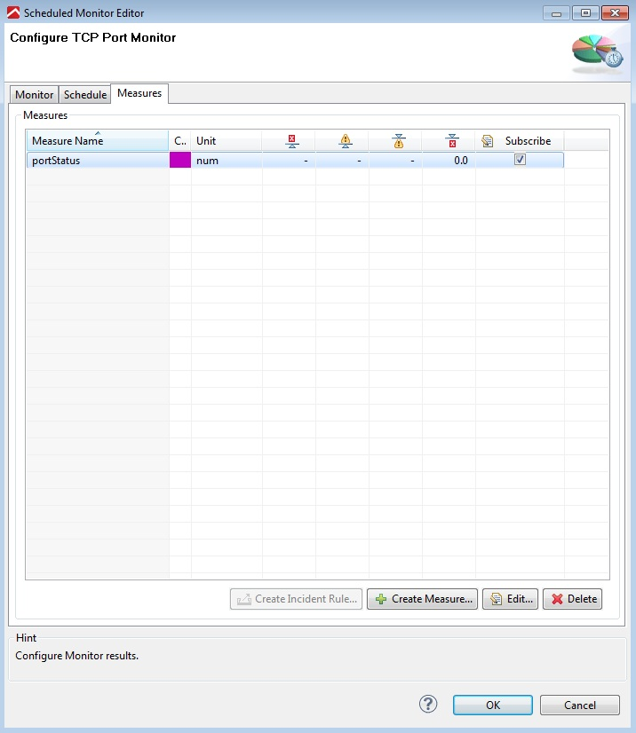
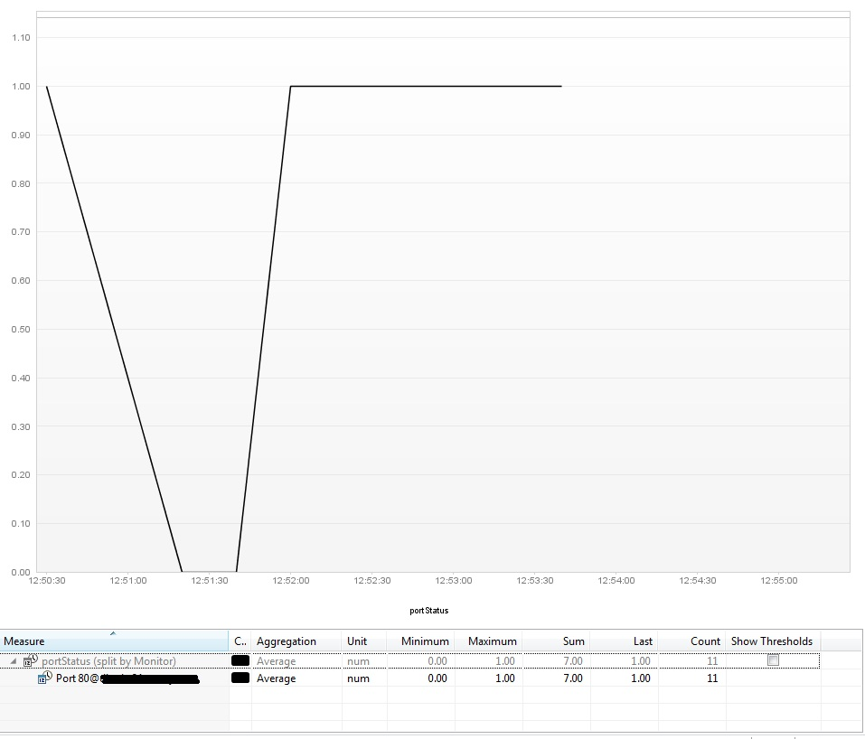
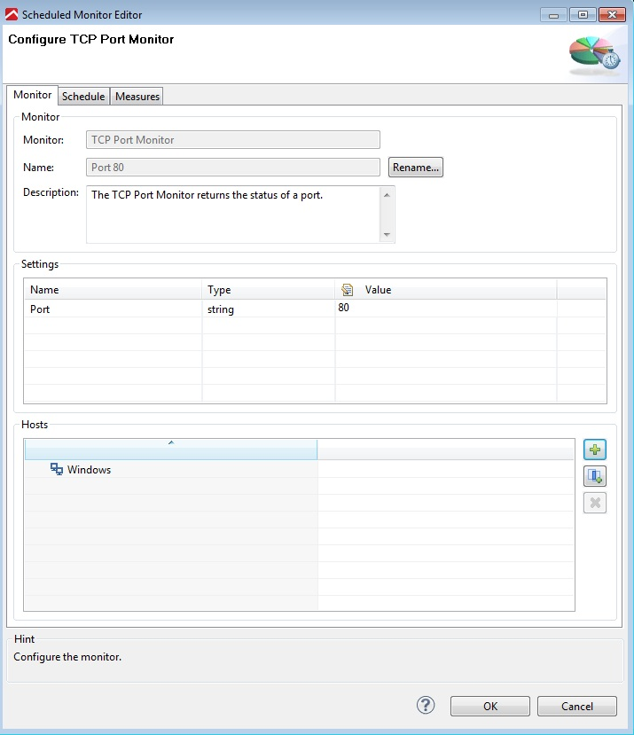

<html xmlns="http://www.w3.org/1999/xhtml">
<head>
    <title>Overview</title>
    <meta http-equiv="Content-Type" content="text/html; charset=UTF-8"/>
    <meta http-equiv="X-UA-Compatible" content="IE=EmulateIE8" />
    <meta content="Scroll Wiki Publisher" name="generator"/>
    <link type="text/css" rel="stylesheet" href="css/blueprint/liquid.css" media="screen, projection"/>
    <link type="text/css" rel="stylesheet" href="css/blueprint/print.css" media="print"/>
    <link type="text/css" rel="stylesheet" href="css/content-style.css" media="screen, projection, print"/>
    <link type="text/css" rel="stylesheet" href="css/screen.css" media="screen, projection"/>
    <link type="text/css" rel="stylesheet" href="css/print.css" media="print"/>
</head>
<body>
                <h1>Overview</h1>
    

            
            

    

The TCP Port Monitor plugin creates a stream socket that connects to the specified port on the named host. It returns the status of the port as a measure.    

    

        <table>
<thead class=" "></thead><tfoot class=" "></tfoot><tbody class=" ">    <tr>
            <td rowspan="1" colspan="1">
        

            
            

            </td>
                <td rowspan="1" colspan="1">
        

            
            

            </td>
                <td rowspan="1" colspan="1">
        

            
            

            </td>
        </tr>
    <tr>
            <td rowspan="1" colspan="1">
        

Measures provided by TCP Monitor    

            </td>
                <td rowspan="1" colspan="1">
        

Example dashboard    

            </td>
                <td rowspan="1" colspan="1">
        

Monitor configuration    

            </td>
        </tr>
</tbody>        </table>
            

    

        <table>
<thead class=" "></thead><tfoot class=" "></tfoot><tbody class=" ">    <tr>
            <td rowspan="1" colspan="1">
        

Name    

            </td>
                <td rowspan="1" colspan="1">
        

<strong class=" ">TCP Port Monitor Plugin</strong>    

            </td>
        </tr>
    <tr>
            <td rowspan="1" colspan="1">
        

Description    

            </td>
                <td rowspan="1" colspan="1">
        

The TCP Port Monitor plugin creates a stream socket that connects to the specified port on the named host, and returns the status as a measure.    

            </td>
        </tr>
    <tr>
            <td rowspan="1" colspan="1">
                </td>
                <td rowspan="1" colspan="1">
                </td>
        </tr>
    <tr>
            <td rowspan="1" colspan="1">
        

Plug-In Version    

            </td>
                <td rowspan="1" colspan="1">
        

3.5.2    

            </td>
        </tr>
    <tr>
            <td rowspan="1" colspan="1">
        

Compatible with    

            </td>
                <td rowspan="1" colspan="1">
        

dynaTrace 3.5+,4+    

            </td>
        </tr>
    <tr>
            <td rowspan="1" colspan="1">
        

Author    

            </td>
                <td rowspan="1" colspan="1">
        

Derek Abing    

            </td>
        </tr>
    <tr>
            <td rowspan="1" colspan="1">
        

License    

            </td>
                <td rowspan="1" colspan="1">
        

<a href="attachments_5275722_2_dynaTraceBSD.txt">dynaTrace BSD</a>    

            </td>
        </tr>
    <tr>
            <td rowspan="1" colspan="1">
        

Support    

            </td>
                <td rowspan="1" colspan="1">
        

<a href="https://community/display/DL/Support+Levels">Not Supported</a>    

            </td>
        </tr>
    <tr>
            <td rowspan="1" colspan="1">
        

Downloads    

            </td>
                <td rowspan="1" colspan="1">
        

<a href="attachments_86409367_1_com.dynatrace.diagnostics.plugins.TCPPortMonitor_3.5.2.jar">com.dynatrace.diagnostics.plugins.TCPPortMonitor_3.5.2.jar</a>    

            </td>
        </tr>
    <tr>
            <td rowspan="1" colspan="1">
        

Known Problems    

            </td>
                <td rowspan="1" colspan="1">
        

none    

            </td>
        </tr>
</tbody>        </table>
            

    

    

    

        <table>
<thead class=" ">    <tr>
            <td rowspan="1" colspan="1">
        

&nbsp;    

            </td>
                <td rowspan="1" colspan="1">
        

<a href="TCP_Port_Monitor_Plugin.html">File</a>    

            </td>
                <td rowspan="1" colspan="1">
        

<a href="TCP_Port_Monitor_Plugin.html">Modified</a>    

            </td>
        </tr>
</thead><tfoot class=" "></tfoot><tbody class=" ">    <tr>
            <td rowspan="1" colspan="1">
                </td>
                <td rowspan="1" colspan="1">
        

Java Source                    <a href="https://community/download/attachments/86147583/com.dynatrace.diagnostics.plugins.TCPPortMonitor_3.5.2.jar?api=v2">com.dynatrace.diagnostics.plugins.T&hellip;</a>    

            </td>
                <td rowspan="1" colspan="1">
        

Jun 25, 2012by<a href="    /community/display/~wolfgang.gottesheim@compuware.com ">Wolfgang Gottesheim</a>    

            </td>
        </tr>
    <tr>
            <td rowspan="1" colspan="1">
                </td>
                <td rowspan="1" colspan="2">
        

    

    

Labels    

<ul class="label-list has-pen "><li class="no-labels-message ">    

No labels    

</li><li class="labels-edit-container ">    

<a href="TCP_Port_Monitor_Plugin.html">Edit Labels</a>    

</li></ul>    

    

            </td>
        </tr>
</tbody>        </table>
            

<ul class=" "><li class="drop-zone-text hidden ">    

Drag and drop to upload or browse for files    

            
        </li></ul>    

Upload fileFile description    

            

        

        

        

    

</body>
</html>
